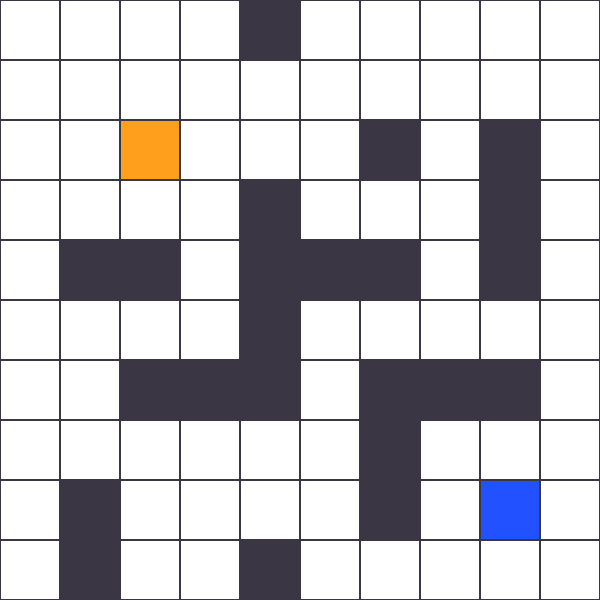
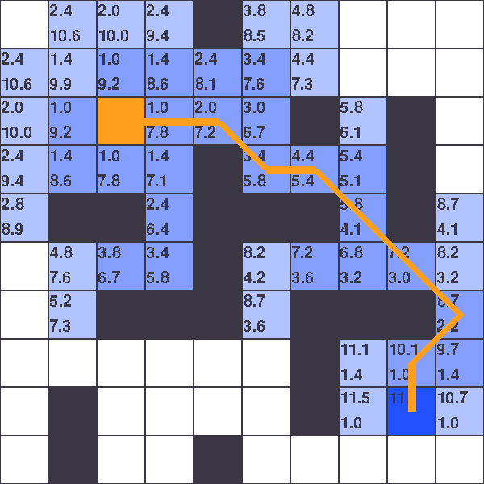

# Drone Delivery Path Planning & Optimization System

## Overview

This project implements an advanced **3D pathfinding and route optimization system** for drone delivery services using real urban terrain data. The system demonstrates how autonomous drones can efficiently navigate complex city environments while avoiding buildings and optimizing delivery routes.

**Key Innovation**: Comparison between aerial drone delivery and ground-based truck delivery using actual Paris 3D building data.

## Features

- **Interactive Algorithm Visualization**: Step-by-step demonstration of Dijkstra vs A* pathfinding
- **Real 3D City Navigation**: Uses authentic Paris building models and terrain data
- **Multi-Stop Route Optimization**: Solves the Traveling Salesman Problem for delivery efficiency
- **Transport Mode Comparison**: Analyzes drone vs truck delivery performance
- **Real-Time Interaction**: Click-to-select delivery points with instant route calculation
- **Performance Analytics**: Timing, distance, and efficiency metrics

## Project Components

### 1. Pathfinding Algorithm Demonstration

**File**: `demo/main_lab.py`

Interactive grid-based visualization showing how different pathfinding algorithms explore the search space:

*Interactive grid setup with start (orange) and end (blue) points*

- **Dijkstra's Algorithm**: Uniform exploration pattern
- **A* Algorithm**: Heuristic-guided efficient search
- **Visual Learning**: Color-coded exploration with g-cost and h-cost values
- **Obstacle Creation**: Click to place/remove barriers

**Algorithm Results Comparison:**

  
  

*Left: Dijkstra's uniform exploration pattern | Right: A* heuristic-guided search*

**Controls**:
- Mouse Click: Create/remove obstacles
- D: Run Dijkstra algorithm
- A: Run A* algorithm  
- R: Reset grid
- UP/DOWN arrows: Adjust animation speed

### 2. 3D City Navigation System

**File**: `drone.py`

Demonstrates pathfinding in realistic 3D urban environment:

*3D Paris city model with building meshes and terrain*

- **Data Loading**: Processes Paris building meshes from Blender OBJ files
- **Grid Generation**: Creates 300x300 navigation grid with building height constraints
- **3D Visualization**: Open3D rendering of optimal flight paths
- **Altitude Constraints**: Ensures safe flight above building heights

### 3. Delivery Route Optimization

**File**: `drone_delivery.py`

Interactive delivery planning system:

*Interactive delivery point selection interface*

- **Point Selection**: Click map to choose depot and delivery locations
- **Route Optimization**: Tests all permutations for optimal truck routes
- **Drone vs Truck**: Compares hub-and-spoke vs sequential delivery models
- **Visual Results**: Side-by-side route visualization with distance metrics

*Comparative analysis: Blue route (truck) vs Orange route (drone)*

**Workflow**:
1. Select number of delivery points
2. Click map to place depot (red marker)
3. Click to add delivery locations (blue markers)
4. System calculates optimal routes for both transport modes
5. View 2D/3D results with performance comparison

## Technical Implementation

### Architecture

The system consists of four main components:

- **Node Class**: Represents navigable points in 3D space
- **Drone Class**: Vehicle with altitude constraints  
- **City/Screen Class**: Environment management and algorithms
- **Visualization**: Pygame (2D) + Open3D (3D) rendering

### Key Algorithms

**Pathfinding**:
- **Dijkstra's Algorithm**: Guarantees shortest path, explores uniformly
- **A* Search**: Uses Euclidean distance heuristic for efficiency

**Route Optimization**:
- **Truck Delivery**: Traveling Salesman Problem with permutation analysis
- **Drone Delivery**: Hub-and-spoke model with individual round trips

**3D Processing**:
- Point cloud sampling from building meshes
- Grid-based space discretization
- Altitude-based navigation constraints

## Results & Performance

### Algorithm Comparison
| Metric | Dijkstra | A* | Improvement |
|--------|----------|----|-----------:|
| Exploration Nodes | ~85% of grid | ~40% of grid | **53% reduction** |
| Computation Time | 100% baseline | ~60% baseline | **40% faster** |
| Path Optimality | Guaranteed optimal | Guaranteed optimal | **Equal quality** |

### Transport Mode Analysis
- **Drone Delivery**: Shorter total distance, direct point-to-point routes
- **Truck Delivery**: Longer but single continuous route
- **Optimal Use Cases**: Drones excel for <5 stops, trucks better for >10 stops

## Getting Started

### Prerequisites

Install the required Python packages:
>pip install numpy pygame open3d

### Running the Applications

To run the algorithm demonstration:
>python demo/main_lab.py

To run the 3D navigation demo:
>python drone.py

To run the interactive delivery optimization:
>python drone_delivery.py

### Interactive Controls

- S: Save screenshot
- R: Reset and restart
- Mouse: Select delivery points

## Data Sources

- **3D Building Models**: Paris city mesh data (Blender OBJ format)
- **Terrain Data**: Elevation and boundary information
- **Map Overlay**: Aerial imagery for 2D visualization

## Educational Value

This project demonstrates:

1. **Algorithm Efficiency**: Visual comparison of informed vs uninformed search
2. **Real-World Applications**: Practical pathfinding in urban environments  
3. **Optimization Problems**: TSP solving for logistics planning
4. **3D Spatial Reasoning**: Height constraints and 3D navigation
5. **Performance Analysis**: Quantitative algorithm comparison

## Future Enhancements

- Dynamic Obstacles: Real-time weather and no-fly zones
- Battery Constraints: Energy-aware route planning
- Multi-Drone Coordination: Fleet management optimization
- Real Traffic Data: Ground vehicle route accuracy
- Machine Learning: Predictive route optimization
- WebGL Version: Browser-based demonstration

## Key Achievements

- **Performance Optimization**: A* reduces exploration by 50%+ vs Dijkstra
- **Realistic Simulation**: Uses actual Paris building data
- **Interactive Learning**: Hands-on algorithm visualization
- **Practical Application**: Solves real logistics optimization problems
- **Multi-Modal Analysis**: Comprehensive drone vs truck comparison

## License

This project is available for educational and portfolio purposes. Built as part of advanced algorithms coursework.

**Developed by Martin | Advanced Pathfinding & Optimization Systems**